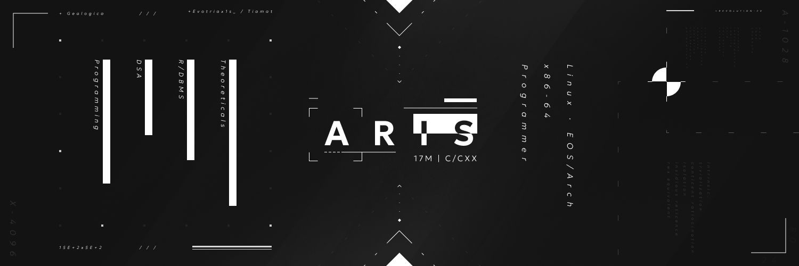

 

# Cool looking stuff: 
  

# OS:
- x86_64 Endeavour Arch Linux  
- Dotfiles: ML4W configured + KDE Plasma 6 icon integrations + adw-gtk3-dark

# Educational and interest(s) stuff:
- 1st year CSE student
- Linux
- Compiler design
- Automation

### 5.37CPS | 14cm/360 | 800 DPI | speed + precision
