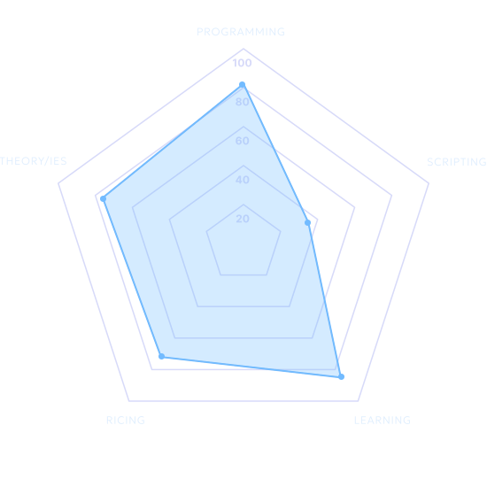

<h2>16 year old university student who loves programming and automates things using scripting</h2>

# Programming/scripting things:
- Vanilla C
- C++ (basic)
- Nano bash scripting
- HTML5
- CSS3
- will learn JS, Python, etc. for DC bots

 

# Cool looking stuff:
 
 

# OS:
- x86_64 Endeavour Arch Linux  
- Dotfiles: ML4W configured + KDE Plasma 6 icon integrations + adw-gtk3-dark

# Educational and interest(s) stuff:
- 1st year CSE student
- Computational mathematical programs
- EOS Linux ricing
- DSA theoreticals
- Cant make or handle CMake files properly

# Other stuff I probably should not include:
- Arcaea: NC'd BYD 11, EX+ on BYD 9+
- Aim trainers: 4.72CPS | 14cm/360 | 800 DPI | speed + precision
